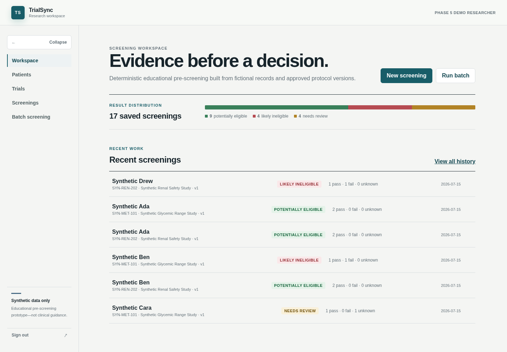
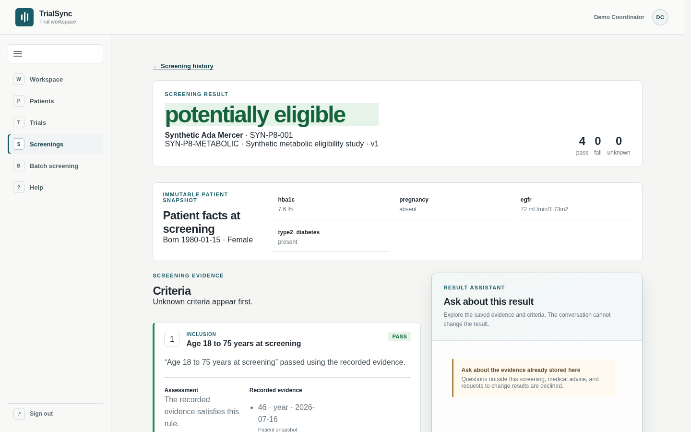
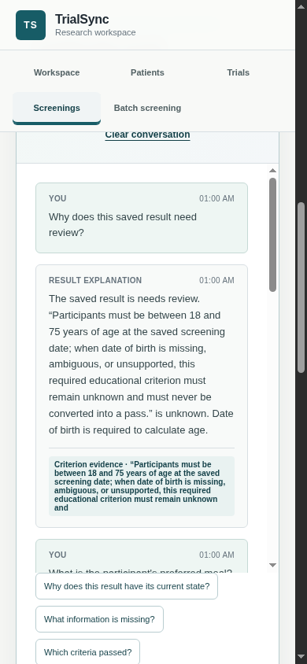
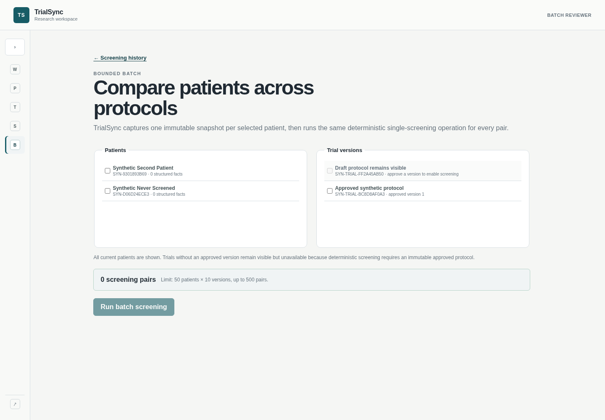
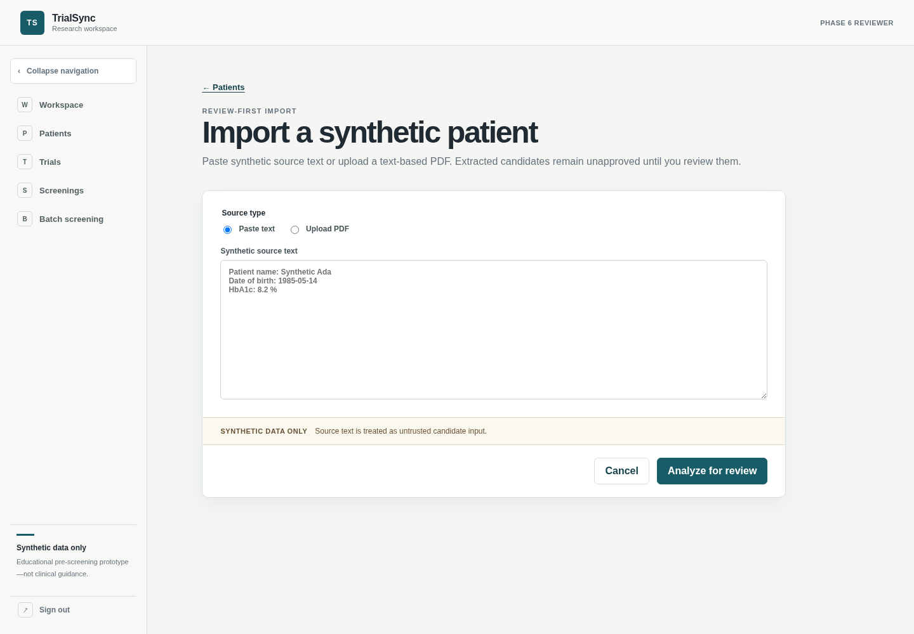

# TrialSync

TrialSync is an academic full-stack project for **Clinical Trial Patient Matching and Dropout Prediction**. It combines explainable patient–trial matching with an incremental research layer for fixed-horizon dropout-risk modelling, cohort intelligence, and RAG over trial eligibility criteria. The current core connects a deterministic `pass`, `fail`, and `unknown` eligibility engine to immutable patient snapshots, approved trial versions, transactional single/batch screening history, and an evidence-first screening workspace.

The deterministic matching result is the foundation. The research extension has implemented the R3 synthetic dataset generator; later phases will add separately versioned dropout-risk predictions, scenario analysis, SHAP explanations, DBSCAN/FAISS cohort exploration, and a LangChain/Gemini RAG workflow that retrieves approved trial criteria and generates a structured eligibility summary.

## Prerequisites

- Python 3.12 or newer
- Node.js 20.19 or newer and npm
- Docker Engine with Docker Compose
- Tesseract OCR and Poppler (`tesseract-ocr` and `poppler-utils` on Debian/Ubuntu)

## First-time setup

Run these commands from the repository root:

```bash
cp .env.example .env
```

The copied values are local placeholders. Change `POSTGRES_PASSWORD`, the matching password inside `DATABASE_URL`, and `TRIALSYNC_AUTH_SECRET` if this database is accessible beyond your machine. The auth secret must contain at least 32 characters.

Start PostgreSQL and wait for its health check:

```bash
docker compose config --quiet
docker compose up -d --wait db
```

Create the backend environment, install the pinned project dependencies, and apply migrations:

```bash
python3 -m venv backend/.venv
backend/.venv/bin/python -m pip install --upgrade pip
backend/.venv/bin/python -m pip install -e './backend[dev]'
backend/.venv/bin/alembic -c backend/alembic.ini upgrade head
```

Install the frontend dependencies from the checked-in lockfile:

```bash
npm --prefix web ci
```

## Run locally

Use two terminals from the repository root.

Backend:

```bash
backend/.venv/bin/uvicorn trialsync.main:create_app --factory --app-dir backend/src --reload
```

Frontend:

```bash
npm --prefix web run dev
```

Open `http://localhost:5173` (or `http://127.0.0.1:5173`). The API documentation is at `http://localhost:8000/docs`. Health endpoints are:

- `GET http://localhost:8000/health/live` — process liveness only.
- `GET http://localhost:8000/health/ready` — database connectivity and migration status.

## Product tour

The current workspace is organized around an evidence-first dashboard, saved
screening details, synchronous batch matrices, and review-first imports. These
screenshots use only the seeded synthetic workspace:











The browser API base URL comes from `VITE_API_BASE_URL` in the root `.env`; backend settings come from `DATABASE_URL` and `TRIALSYNC_*` variables. No credentials belong in Git.

## Current capabilities

The current workspace supports the evidence-backed matching workflow:

- Match a patient against trial criteria and inspect the evidence behind every result.
- Identify missing facts that block a confident match and preserve immutable screening evidence.
- Review imported synthetic text or PDFs before approving structured facts and criteria.
- Ask evidence-grounded questions about one stored screening without changing its outcome.
- Download a canonical, provider-free PDF report for any saved screening; it is assembled from
  the stored snapshot, approved trial version, and persisted criterion evaluations.

## Research extension status

The full research roadmap is not yet implemented in the running application. R3 has produced its
20-enrollment smoke, 400-enrollment demo, and 4,000-enrollment experiment cohorts. The experiment
cohort contains 702 synthetic day-90 dropouts (17.55% observed prevalence) across a frozen
2,800/600/600 participant-level split. Its EDA, dataset card, feature dictionary, linkage manifest,
leakage report, and checksums are complete; the artifact is awaiting final review before R4 model
comparison begins.

The R3 generator uses the NVIDIA Data Designer 0.8.0 Python package locally with statistical
samplers and dependent expressions. Its current recipe makes no hosted model requests, consumes no
model tokens, and requires no NVIDIA API key. It exports seven linked Parquet source tables and
three leakage-safe model views under the frozen `r3-dataset-contract-v1`; the primary classifier
input is `landmark_day30_features.parquet`. Future fixed-horizon predictions, scenario analysis,
SHAP explanations, DBSCAN/FAISS cohort exploration, and LangChain/Gemini eligibility-criteria work
remain separate from deterministic eligibility.

The public NCT02054715-D1 dictionary and paper can inform a separate study-specific adapter, but
participant rows are not currently a public-demo or clean-setup dependency. Follow
[`docs/nemo-dropout-dataset-generation.md`](docs/nemo-dropout-dataset-generation.md) for the current
local generation workflow and artifact contract.

For a concise explanation of which data will power dropout prediction, SHAP, DBSCAN, and FAISS,
read [`docs/research-analysis-data-map.md`](docs/research-analysis-data-map.md).

The public application, repository, automated tests, and demo are synthetic-data-only. A future
offline benchmark may use NCT02054715-D1 if its participant rows become legitimately accessible
under the source terms, and will never become a public runtime dependency. Eligibility is a reproducible rule-based matching
outcome; optional AI-assisted extraction and explanations never determine it.

## Production deployment

The development `compose.yaml` intentionally runs only PostgreSQL. The full
production stack is defined in `compose.prod.yaml`: Nginx serves the compiled
frontend and proxies the API at the same origin, PostgreSQL remains private to
Compose, and only `127.0.0.1:8081` is published for Cloudflare Tunnel. See
[`agent-docs/DEPLOYMENT.md`](agent-docs/DEPLOYMENT.md) for first deployment, migrations, backup,
restore, upgrades, and the required `trialsync.atuls.me` tunnel origin.

GitHub Actions CI is defined in `.github/workflows/ci.yml` and runs the same backend/frontend
verification gate plus credential-free container builds. Automated CD is intentionally deferred;
manual deployment remains `git pull --ff-only` followed by the health-checked Compose rollout.

## Core workflow

1. Register a demo account at `/register` or sign in at `/login`.
2. Search fictional patients at `/patients` or use **Add patient** for the focused creation flow, then open one to record conditions, medications, observations, and demographics.
3. Search fictional trials at `/trials` or use **Add trial**, then open one, choose **Edit criteria**, and save the current inclusion and exclusion criteria.

All patient and trial queries are scoped to the authenticated owner. List endpoints are intentionally limited to 100 records for the semester demo. Only synthetic data may be entered.

Patient and trial references are generated by the server when `external_id` or
`registry_id` is omitted. An exact case-insensitive patient-name match returns
`PATIENT_NAME_REVIEW_REQUIRED`; resubmit with `confirm_duplicate_name: true` only
after confirming it represents a distinct synthetic person. Detail pages provide
confirmed delete actions. Patient deletion preserves immutable screening snapshots,
while trials referenced by screening history remain protected from deletion.

## Deterministic eligibility engine

The pure package at `backend/src/trialsync/domain` evaluates immutable typed inputs without importing FastAPI, SQLAlchemy, PostgreSQL drivers, hosted providers, ML packages, or the system clock. Callers supply the screening date explicitly:

```python
from trialsync.domain import screen

result = screen(patient_snapshot, approved_trial_version, screening_context)
```

The versioned `1.0` rule DSL supports:

- `and`, `or`, and `not` with three-valued logic.
- `present`, `absent`, `concept_is`, and `concept_in`.
- `eq`, `lt`, `lte`, `gt`, `gte`, and inclusive `between` comparisons.
- `current` and `within_before` temporal wrappers.
- `latest` and `any` numeric selection.

Missing, stale, conflicting, unsupported, or unit-incompatible evidence returns `unknown`; it never silently passes. Inclusion and exclusion criteria share the same raw truth evaluation but convert truth to results according to criterion kind. Any required failure produces `likely_ineligible`, all required passes produce `potentially_eligible`, and every other required-result combination produces `needs_review`.

The API uses JSON bearer-token authentication:

```text
POST /api/v1/auth/register
POST /api/v1/auth/login
GET  /api/v1/auth/me

GET|POST           /api/v1/patients
GET|PATCH|DELETE   /api/v1/patients/{patient_id}
GET                /api/v1/patient-fact-catalog
GET                /api/v1/patients/{patient_id}/activity
GET|POST           /api/v1/clinical-concepts
GET                /api/v1/clinical-concepts/suggestions
PATCH              /api/v1/clinical-concepts/{concept_id}
POST               /api/v1/clinical-concepts/{concept_id}/retire
POST               /api/v1/clinical-concepts/{concept_id}/restore
POST               /api/v1/patients/{patient_id}/facts
PATCH|DELETE       /api/v1/patients/{patient_id}/facts/{fact_id}
POST               /api/v1/patients/{patient_id}/facts/{fact_id}/restore
POST               /api/v1/patients/{patient_id}/unsupported-details
PATCH|DELETE       /api/v1/patients/{patient_id}/unsupported-details/{detail_id}

GET|POST           /api/v1/trials
GET|PATCH|DELETE   /api/v1/trials/{trial_id}
POST               /api/v1/trials/{trial_id}/versions
POST               /api/v1/trials/{trial_id}/versions/draft
PUT|DELETE         /api/v1/trials/{trial_id}/versions/{version_id}
POST               /api/v1/trials/{trial_id}/versions/{version_id}/criteria
POST               /api/v1/trials/{trial_id}/versions/{version_id}/guided-criteria
PUT                /api/v1/trials/{trial_id}/versions/{version_id}/guided-criteria/{criterion_id}
POST               /api/v1/trials/{trial_id}/versions/{version_id}/unsupported-criteria
PUT|DELETE         /api/v1/trials/{trial_id}/versions/{version_id}/criteria/{criterion_id}

POST               /api/v1/screenings
GET                /api/v1/screenings
GET                /api/v1/screenings/{screening_id}
GET                /api/v1/screenings/{screening_id}/report.pdf
POST               /api/v1/screening-batches
GET                /api/v1/screening-batches
GET                /api/v1/screening-batches/{batch_id}

POST               /api/v1/imports
GET|PUT|DELETE     /api/v1/imports/{import_id}
POST               /api/v1/imports/{import_id}/approve

GET                /api/v1/screenings/{screening_id}/conversation
POST               /api/v1/screenings/{screening_id}/conversation/messages
DELETE             /api/v1/screenings/{screening_id}/conversation
```

The authenticated patient-fact catalog is a PostgreSQL-backed semantic source for
routine clinical-detail and trial-criterion entry. It is seeded with the demo
catalog during migration and returned to the client for searchable, dynamic
controls rather than being hard-coded into either form. Fact creation accepts a catalog key plus a tagged
`status`, `pregnancy_status`, or `numeric` value; fact updates accept the tagged
value and the loaded fact revision. The server derives canonical concept codes,
fact types, fixed units, and source labels rather than accepting those fields
from the routine client. Details that are not in the catalog can be retained as
separate review items, but they are never patient facts or screening evidence.
Pregnancy status is also checked against the recorded biological sex: a Male and
Pregnant combination is blocked by the API, while Pregnant with biological sex
not recorded is allowed with a review warning. Patient reads expose stable
`consistency_issues` so legacy conflicts remain visible and resolvable; TrialSync
never infers pregnancy absence or rewrites either value automatically.

See [Clinical Catalog Management](agent-docs/clinical-catalog-management.md) for
the database schema, administrator lifecycle, optional RxNorm/LOINC suggestions,
configuration, safety boundaries, and the staged follow-up plan.

The trial workspace likewise uses the same catalog for guided demographic,
condition, medication, and observation criteria. Routine users work with one
current protocol: **Edit criteria**, make the changes, then **Save protocol**.
The implementation retains immutable internal copies so saved screenings stay
reproducible, but it does not expose draft, revision, ordering, or protocol-history
controls in routine UI. Unsupported criterion wording can be saved for mapping
review, but blocks saving until it is mapped to a supported rule or removed.
Every rule is also recursively validated against the active catalog at criterion
save, import review, and version approval boundaries. Misspelled operators,
unknown fact paths, incompatible units, malformed nested expressions, and
unsupported fact types return a structured validation error rather than becoming
an approved rule. Screening execution still treats invalid or unsupported rules
as `unknown` defensively, and the screening UI distinguishes that trial
configuration problem from missing patient evidence.

## Saved screening history

`POST /api/v1/screenings` accepts a user-owned `patient_id`, an approved
`trial_version_id`, and an optional ISO screening date. It creates or reuses an
immutable patient snapshot, runs the same pure Phase 3 engine, and stores every
criterion result, evidence reference, rejected evidence item, missing-information
requirement, and version field in one transaction.

Deleting a patient after screening detaches the identity record but keeps its
immutable snapshot and screening history. A trial referenced by a saved screening
cannot be deleted. Editing current patient or trial labels never rewrites a stored
criterion outcome.

`POST /api/v1/screening-batches` accepts unique or repeated current `patient_ids`
or existing `patient_snapshot_ids`, plus approved `trial_version_ids`. Current
patients are snapshotted transactionally before screening. IDs are deduplicated before
the configured limits are checked (50 snapshots, 10 trial versions, and 500 pairs).
The bounded Cartesian product runs synchronously with one screening date and one
engine version, and the whole batch rolls back on unexpected persistence failure.
The response includes state totals, the total unknown-criterion count, and a normal
evidence-backed screening ID for every matrix cell.

## Screening workspace

After creating structured synthetic patients and approving a trial version, use the
workspace dashboard to run a single screening. The result page shows the immutable
patient snapshot, approved trial version, every criterion's stored source text,
canonical explanation, supporting evidence, and missing information. Unknown
criteria are shown first. **Download report** produces a canonical PDF from that
same saved screening; it does not call an LLM or recalculate eligibility. The PDF
includes report schema/template versions and a generation timestamp, so the source
screening remains the authority while the downloaded artifact is easy to identify.

`/screenings` provides searchable, filterable history. `/batches/new` lists all
current patients and all trials, clearly disabling trials that have no approved
version. It previews the bounded Cartesian pair count and creates a synchronous
batch. Each batch matrix cell links back to the ordinary evidence-rich screening
detail page. The UI is educational and uses synthetic data only; it does not provide
medical advice or enrollment guidance.

## Reviewed imports

Patient and trial list pages link to a review-first import flow for pasted text and
PDFs. Pasted text is limited to 1 MB and PDFs to 5 MB/10 pages. Encrypted,
malformed, empty, and wrong-type PDFs are rejected with explicit error codes. When a
PDF has insufficient embedded text, TrialSync rasterizes it locally and uses
Tesseract OCR (`tesseract-ocr` plus Poppler's `pdftoppm`) with bounded per-page and
whole-document timeouts. OCR text is visibly labelled in the review UI, retains
page-local provenance, and remains unapproved candidate data; poor scans fail
explicitly and manual entry remains available.

Deterministic parsing proposes profile fields, patient facts, trial criteria, and a
small supported subset of rule structures. Every candidate remains editable and
unapproved, with page and character-span provenance, until the authenticated owner
explicitly approves the review. Patient candidates are matched against the same active
clinical catalog used by manual entry: canonical concepts and fixed units are applied
only after review, while unmatched or incomplete candidates become review-only
unsupported details with visible warnings rather than screening evidence. Patient
approval creates current structured facts and patient activity events.
Trial approval opens the current criteria for editing and then saves the protocol
through the same simple workflow used by manual authoring. Unsupported criterion prose stays visible for manual review
and is never silently converted into an eligibility rule. Hosted NLP remains
optional review assistance and cannot approve or change the deterministic rule.

## Bounded NLP and explanation conversation

Reviewed import uses Groq-assisted extraction by default (`TRIALSYNC_EXTRACTION_PROVIDER=groq`).
With a configured `GROQ_API_KEY`, Groq may propose schema-validated patient facts or
trial criteria from deterministic or local-OCR source text; every proposal must retain an
exact verified source quotation and remains unapproved until human review. Timeout,
rate-limit, invalid-schema, or provider failures fall back visibly to deterministic
candidates and record the provider transition in review metadata.

Saved screening details include a short explanation conversation scoped to that one
authenticated result. The server reloads authoritative evaluations every turn,
validates criterion/evaluation/evidence citations, persists at most the latest 10
messages, and supports chat-only clearing. Previous messages are continuity context,
never patient facts or screening evidence. Advice, diagnosis, enrollment guidance,
cross-record requests, unsupported questions, and prompt injection fail safely.
Canonical explanations and deterministic screening remain available during every
provider failure and cannot be modified through the assistant.

The conversation UI keeps a stable internally scrolling transcript, shows the submitted
question and an accessible typing indicator immediately, and supports Enter to send or
Shift+Enter for a new line. Suggestions are evenly arranged, locally deduplicated, and
topic-bounded. Focus returns to the composer after a response or recoverable error;
citation links focus the referenced criterion and provide a visible route back to the
assistant. Confirmed provider failures preserve the question and expose an explicit retry;
ambiguous connection failures require reloading history first to avoid duplicate
persistence. Server logs
record privacy-safe chat latency, provider/model/prompt version, validation outcome, answer
state, and citation count without recording question text, document text, raw provider
payloads, or secrets.

The default hosted model is configurable through `TRIALSYNC_GROQ_MODEL`. As verified
in the official [Groq supported-model list](https://console.groq.com/docs/models) and
[structured-output guide](https://console.groq.com/docs/structured-outputs) on
2026-07-29, `openai/gpt-oss-20b` is a production model supporting strict JSON-schema
output. Set `TRIALSYNC_EXTRACTION_PROVIDER` to `auto`, `rule_based`, `groq`, or
`disabled`; set `TRIALSYNC_SCREENING_CHAT_PROVIDER` to `auto`, `canonical`, `groq`,
or `disabled`. Never send real patient data. The held-out synthetic evaluation and
its live-provider limitations are documented in
`backend/evaluation/PHASE7_EVALUATION.md`.

Catalog administrators can optionally ask for terminology suggestions while adding
a local detail. Medication suggestions use RxNav's active approximate-match API;
observation suggestions use LOINC's Search API when
`TRIALSYNC_LOINC_USERNAME` and `TRIALSYNC_LOINC_PASSWORD` are configured. A free LOINC website
login supplies those two values; there is no separate API key for this Search API integration.
LOINC uses HTTP Basic Authentication and currently describes the Search API as a pilot, so the app
treats both sources as best-effort lookup only. See the official
[LOINC API authentication guidance](https://loinc.org/kb/api/auth). A suggestion never creates,
changes, or screens a concept
on its own: the administrator must select it, review the populated fields, and
save the local concept. Selected RxNorm/LOINC code provenance is stored on that
local concept. Set `TRIALSYNC_TERMINOLOGY_SUGGESTIONS_ENABLED=false` to disable
external lookup entirely.

## Reproducible demo and evaluation

Create or restore the fixed synthetic development account and its deterministic
screening matrix:

```bash
make seed-demo
```

Sign in with `demo@trialsync.example` / `SyntheticDemo123!`. The login page can
fill these public synthetic credentials with **Use demo account**. The seed is
idempotent: it replaces only that demo account and creates six fictional patients,
two approved trials, 12 linked screenings with a balanced 4/4/4 state distribution,
and supported/refused/insufficient conversation history. It refuses to run in the
production environment.

The six seeded patients are Synthetic Ada Mercer, Synthetic Ben Carter, Synthetic
Cora Bennett, Synthetic Dev Malik, Synthetic Emi Tanaka, and Synthetic Finn Osei.

Reset only this fixed account with:

```bash
make reset-demo
```

For a larger controlled workspace, keep the demo account, remove every other
local user, and create the admin workspace with 20 fully populated patient
records, 15 approved trials (five inclusion and five exclusion criteria per
trial), and 300 saved screening results: 40% potentially eligible, 40% likely
ineligible, and 20% needs review.

```bash
backend/.venv/bin/python -m trialsync.demo seed-admin
```

Sign in as `admin@trialsync.example` with `AdminWorkspace2026!`.
That account also receives the **Catalog** navigation item. It can add local
conditions, medications, and fixed-unit observations, choose whether they are
available for trial criteria, and retire or restore them. Retiring a concept only
stops new entry; it never rewrites saved facts, criteria, or screening evidence.

The `/help` route summarizes the supported workflow, data boundary, and keyboard
shortcuts. Reproduce the machine-readable measurements with `make evaluate`; the
detailed results and live-provider limitations are in
`backend/evaluation/PHASE8_EVALUATION.md`. Extraction measurements describe
reviewable candidate structures, never eligibility confidence.

The six critical browser journeys use installed system Chromium and local ports 8002
and 5175:

```bash
make test-e2e
```

The preparation step reseeds the fixed demo account and writes a generated,
machine-readable synthetic PDF to `/tmp`; it does not use Groq or the network.

## Verification

With `.env` present and PostgreSQL running, run the complete backend/frontend gate
from the repository root:

```bash
docker compose up -d --wait db
make verify
make audit
```

`make verify-backend` and `make verify-frontend` provide narrower full-suite gates.
`make audit` checks installed Python packages and the locked npm tree against current
advisory data, so it requires network access.

As of 2026-08-13, patched `pypdf`, `js-yaml`, `nanoid`, and PostCSS versions clear
their recorded advisories, and the npm audit reports zero vulnerabilities. One Python
advisory is narrowly ignored by the project audit: Data Designer 0.8.0 (and the latest
checked 0.9.1) requires `cryptography <=49`, while `PYSEC-2026-3552` is fixed in 50.0.0.
The constraint, non-applicable PKCS#7-decryption path, controls, and mandatory review
condition are recorded in
[`agent-docs/dependency-security-exceptions.md`](agent-docs/dependency-security-exceptions.md).

The backend import is intentionally side-effect free: it does not connect to PostgreSQL, create tables, or load models. Schema changes are made only through Alembic.

## Current scope

The implemented application covers owner-scoped synthetic patient and trial records, deterministic
single and batch screening, reviewed text/PDF imports, bounded Groq-assisted candidate extraction,
and evidence-grounded screening conversations. The R3 synthetic dataset generator is implemented
as an offline research tool; dropout models and all runtime research interfaces remain future work
and are not represented as current product capabilities.

This is an educational prototype, not a medical device, clinical decision system, or production hospital service.

## License

TrialSync is available under the [MIT License](LICENSE).
